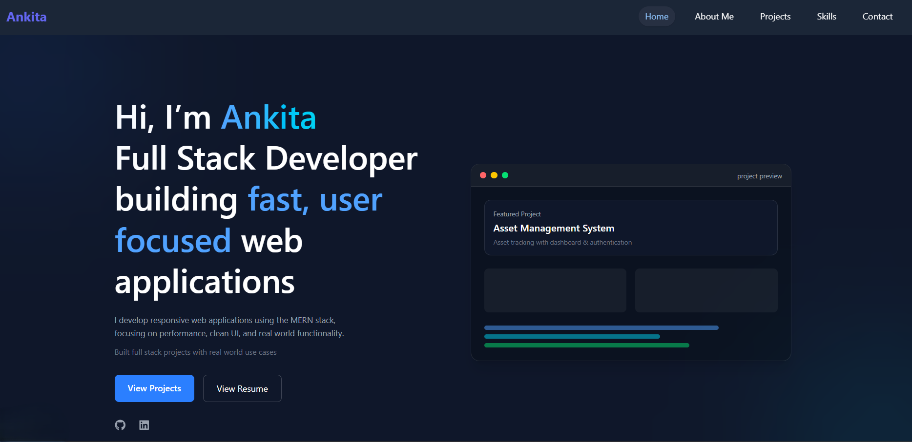
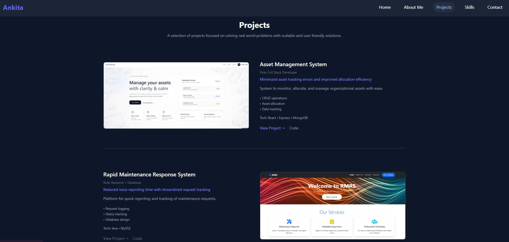
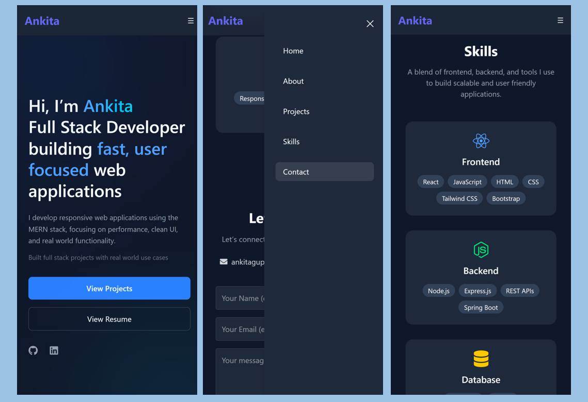

# Ankita Portfolio Website

A modern and responsive personal portfolio website built to showcase my projects, technical skills, and development journey.

## Tech Stack

- React.js
- Vite
- Tailwind CSS
- Framer Motion
- JavaScript

## Features

- Fully Responsive Design
- Modern Clean UI
- Smooth Animations using Framer Motion
- Project Showcase Section
- Skills & About Sections
- Contact Section
- Optimized Performance with Vite

## Screenshots

### Homepage


### Projects Section


### Mobile Responsive View



## Folder Structure

```
portfolio/
├── public/
├── screenshots/
├── src/
│   ├── assets/
│   ├── components/
│   ├── sections/
│   ├── App.jsx
│   └── main.jsx
│
├── package.json
└── README.md
```

## Installation & Setup

Clone the repository:

```bash
git clone https://github.com/ankita-gupta83/ankita-portfolio.git
```

Navigate to project folder:

```bash
cd ankita-portfolio
```

Install dependencies:

```bash
npm install
```

Start development server:

```bash
npm run dev
```

## Future Improvements

- Dark/Light Theme Toggle
- Backend Contact Form
- More Interactive Animations
- Blog Section


## 👩‍💻 Author

Ankita Gupta

- GitHub: https://github.com/ankita-gupta83
- LinkedIn: https://linkedin.com/in/ankita-gupta004
<!-- - Portfolio: https://your-vercel-link.vercel.app -->


##  If you like this project

Give it a star on GitHub ⭐